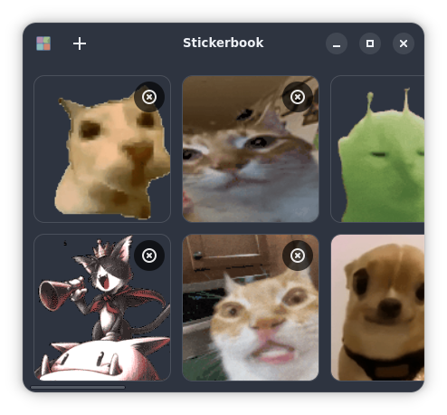

# stickerbook


## collect and display digital stickers



## building

```
flatpak install flathub org.gnome.Sdk//49 org.freedesktop.Sdk.Extension.rust-stable org.freedesktop.Sdk.Extension.node20	
```
